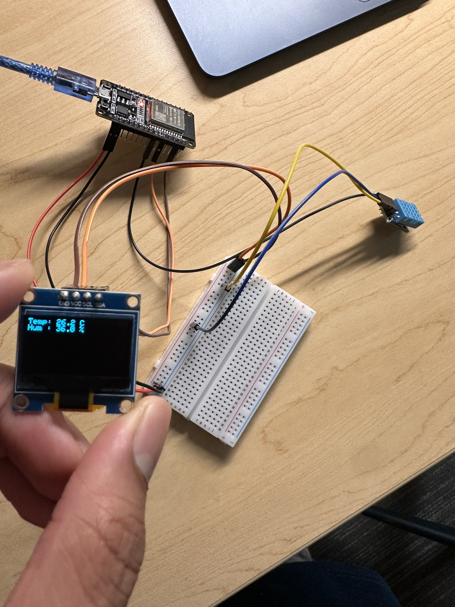

📡 Mobile Temperature Reader

ESP32 + DHT11 + OLED + Express + React

A full-stack IoT project that reads temperature and humidity from an ESP32, displays it locally on an OLED, and publishes the data to a cloud-hosted API for real-time viewing in a web application.

🖼️ Hardware Setup (Required)

📸 Circuit Image

Adding the image

Convert your .HEIC image to .jpg or .png

Create an images/ folder in the repo

Add the image as images/circuit.jpg

Commit and push

⚠️ This project requires the circuit to be built before deployment.

🧱 System Architecture
ESP32 (DHT11 + OLED)
   |
   |  HTTP POST (JSON)
   v
Express.js Backend (Render)
   |
   |  HTTP GET
   v
React + Vite Frontend

📁 Project Structure
esp32/     → Embedded firmware (PlatformIO)
server/    → Express backend API
client/    → React + Vite frontend

🔌 ESP32 Firmware (PlatformIO)

Purpose

Reads temperature & humidity from DHT11

Displays values on SSD1306 OLED

Sends sensor data to backend via HTTP

Key Features

DHT11 on GPIO 18

I2C OLED (SDA 21, SCL 22)

HTTP POST with JSON payload

WiFi credentials & server URL stored in config.h (not committed)

{"temperature": 24.3, "humidity": 52.1}

🌐 Backend (Express.js)

Purpose

Acts as a REST API between ESP32 and frontend

Stores latest sensor reading in memory

Deployed as a persistent server on Render

Endpoints

POST /api/data  → ESP32 sends sensor data
GET  /api/data  → Frontend fetches latest reading

Key Concepts Used

Express routing

CORS middleware

JSON body parsing

Environment-based port selection

💻 Frontend (React + Vite)

Purpose

Displays live sensor data in the browser

Fetches data from backend API

Features

TypeScript + React hooks

Environment-based API URL

Simple polling model

fetch(import.meta.env.VITE_API_URL)

🚀 How to Deploy This Project Yourself
Prerequisites

ESP32 + DHT11 + SSD1306 OLED wired correctly

GitHub account

Render account

Node.js + PlatformIO installed

1️⃣ Clone the Repository
git clone https://github.com/sinhah935/Mobile-Temperature-Reader.git

2️⃣ Deploy the Backend (Render)

Go to Render → New Web Service

Select the server/ directory

Set:

Build Command: npm install

Start Command: node index.js

Render will assign a public URL:

https://your-service.onrender.com

3️⃣ Configure the ESP32

Create config.h (not committed):

#define WIFI_SSID "your_wifi"
#define WIFI_PASSWORD "your_password"
#define SERVER_URL "https://your-service.onrender.com/api/data"

Upload firmware using PlatformIO.

4️⃣ Run the Frontend
cd client
npm install
npm run dev

Set .env:

VITE_API_URL=https://your-service.onrender.com/api/data

⚠️ Important Notes

ESP32 must be connected to WiFi to send data

Eduroam does not support ESP32 authentication

Express backends require persistent servers (not Vercel)

HEIC images are not supported by GitHub

📌 Future Improvements

WebSockets for real-time updates

Database storage

Charts & historical data

MQTT instead of HTTP

🧠 Skills Demonstrated

Embedded C++, I2C, REST APIs, Express.js, React + TypeScript, cloud deployment, IoT system design
